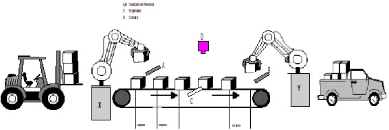

Banda transportadora de cajas con sensores y actuadores
=======================================================

## Descripción



El robot X coloca 10 cajas en una banda transportadora que se mueve un `paso`
cada vez que se coloca una caja (detectado por A). No se puede colocar una caja
mientras A está activo. Al final de la faja un robot las recoge cada vez que se
activa el sensor B (la faja no puede avanzar un paso si B esta activo). En medio
de la faja hay una cámara que verifica continuamente la calidad de la caja. Si
la caja esta fallada, el sensor D entregara un valor > 100 (sin unidades) y
dicha caja es expulsada por C.

Cada vez que el robot X coloque una caja en la faja, se incrementará un entero
tipo protegido, el cual será decrementado cada vez que se retire una caja por
el robot Y.

Por otro lado, cada vez que una caja fallada es expulsada se llevará la cuenta
en una variable, de tal manera que al final de la tarea dicha variable deberá
verificarse: si el valor es cero se imprime un mensaje de `Proceso
satisfactorio` de lo contrario 'Pérdida en el camino'.

Luego que el robot X haya colocado la ultima caja, la faja avanzara
automáticamente 6 pasos (siempre que B se lo permita)  para asegurar que todas
las cajas son recogidas por el robot Y.

## Estructura de archivos

Los archivos `planta.h` y `planta.c` brindran una interfaz para interactuar con
la planta simulada, permitiendo leer los sensores y exitar los actuadores.

El archivo `test.c` muestra la funcionalidad del código sin uso de concurrencia.
Y partiendo de este archivo, `main.c` implementea el proceso deseado aplicando
la concurrencia en la exitación de los actuadores.

Las salida de los programas `test.c` y `main.c` se encuentran en los archivos
`test.out.txt` y `run.out.text` respectivamente.

Para generar el archivo `test.out.txt`, emplear el siguiente comando:

```bash
make test > test.out.txt
```

Para generar el archivo `test.out.txt`, emplear el siguiente comando:

```bash
make run > run.out.txt
```

## Créditos
Problema planteado por el Ing. Eddie Angel Sobrado Malpartida.
